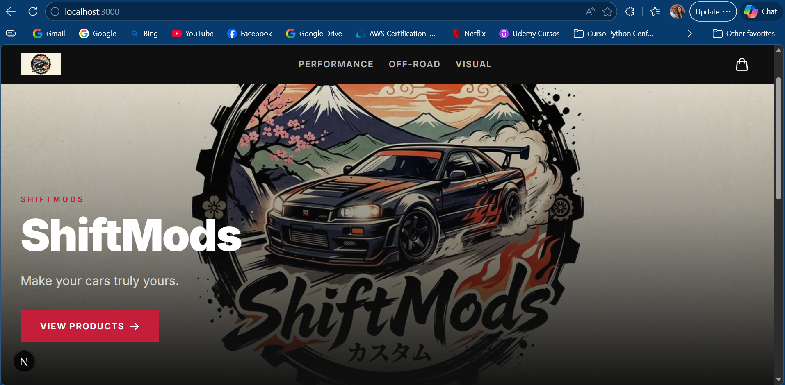

# ShiftMods



**ShiftMods** is a headless e-commerce storefront for car mods and accessories — built for sport, tuner, crossover SUV, and off-road builds. It combines editorial content management with live Shopify inventory, delivering a fast, fully typed shopping experience.

---

## Stack

| Layer | Technology |
|---|---|
| Framework | [Next.js 16](https://nextjs.org) — App Router, Server Components, Server Actions |
| Language | TypeScript (strict mode) |
| Styling | [Tailwind CSS v4](https://tailwindcss.com) with custom brand palette |
| CMS | [Sanity v3](https://www.sanity.io) — embedded Studio at `/studio` |
| Commerce | [Shopify Storefront API](https://shopify.dev/docs/api/storefront) (GraphQL, 2025-01) |
| Fonts | Inter via `next/font/google` |
| Deployment | [Vercel](https://vercel.com) (recommended) |

---

## Features

- **Headless Shopify** — products, collections, variants and cart fully managed via the Storefront GraphQL API with typed fetch wrapper and ISR cache tags
- **Sanity editorial layer** — hero sections, editorial product descriptions, specs, and site settings managed in the embedded Studio
- **Optimistic cart** — client-side cart state using React 19 `useOptimistic`, persisted in `localStorage` via Server Actions
- **ISR revalidation** — Sanity webhook at `/api/revalidate` triggers `revalidateTag('sanity')` on publish
- **Fully typed** — end-to-end TypeScript for every Shopify and Sanity data shape

---

## Project Structure

```
app/
  layout.tsx                    # Root layout — CartProvider, Header, Footer
  page.tsx                      # Home page — hero + featured products
  collections/[slug]/page.tsx   # Collection page with generateStaticParams
  studio/[[...tool]]/           # Embedded Sanity Studio
  api/revalidate/route.ts       # Sanity webhook revalidation endpoint

components/
  Header.tsx                    # Sticky nav with logo, collection links, cart badge
  HeroSection.tsx               # Full-viewport hero from Sanity
  ProductCard.tsx               # Product card with Shopify image + Sanity editorial
  ProductGrid.tsx               # Responsive 2→4 column product grid

lib/
  shopify/client.ts             # shopifyFetch<T>() — typed Storefront API wrapper
  shopify/types.ts              # All Shopify TypeScript types
  shopify/queries.ts            # GraphQL queries and mutations (fragment-safe)
  sanity/client.ts              # sanityClient, serverClient, urlFor()
  sanity/types.ts               # Sanity TypeScript types
  sanity/queries.ts             # GROQ queries
  actions/cart.ts               # Server Actions for cart CRUD

context/
  CartContext.tsx               # Cart state with useOptimistic + localStorage

sanity/
  schemaTypes/                  # heroSection, editorialProduct, siteSettings schemas
sanity.config.ts                # Studio config with structure builder
```

---

## Getting Started

### 1. Install dependencies

```bash
npm install
```

### 2. Configure environment variables

```bash
cp .env.local.example .env.local
```

Fill in your Sanity project credentials ([manage.sanity.io](https://manage.sanity.io)) and Shopify Storefront API token (Shopify Admin → Sales Channels → Headless).

### 3. Run the development server

```bash
npm run dev
```

Open [http://localhost:3000](http://localhost:3000) for the storefront and [http://localhost:3000/studio](http://localhost:3000/studio) for the Sanity Studio.

### 4. Seed content

In the Studio, create and publish:
1. A **Hero Section** document with an image, headline, subheadline, and CTA
2. A **Site Settings** document referencing the hero section and a Shopify collection handle
3. Optional **Editorial Product** documents keyed by `shopifyHandle` to enrich product cards with editorial copy

---

## Environment Variables

| Variable | Description |
|---|---|
| `NEXT_PUBLIC_SHOPIFY_STORE_DOMAIN` | Your store domain, e.g. `your-store.myshopify.com` |
| `SHOPIFY_STOREFRONT_ACCESS_TOKEN` | Public Storefront API access token |
| `NEXT_PUBLIC_SANITY_PROJECT_ID` | Sanity project ID |
| `NEXT_PUBLIC_SANITY_DATASET` | Sanity dataset, usually `production` |
| `SANITY_API_TOKEN` | Server-side Sanity token (Editor role minimum) |
| `SANITY_WEBHOOK_SECRET` | Shared secret for Sanity revalidation webhook |
